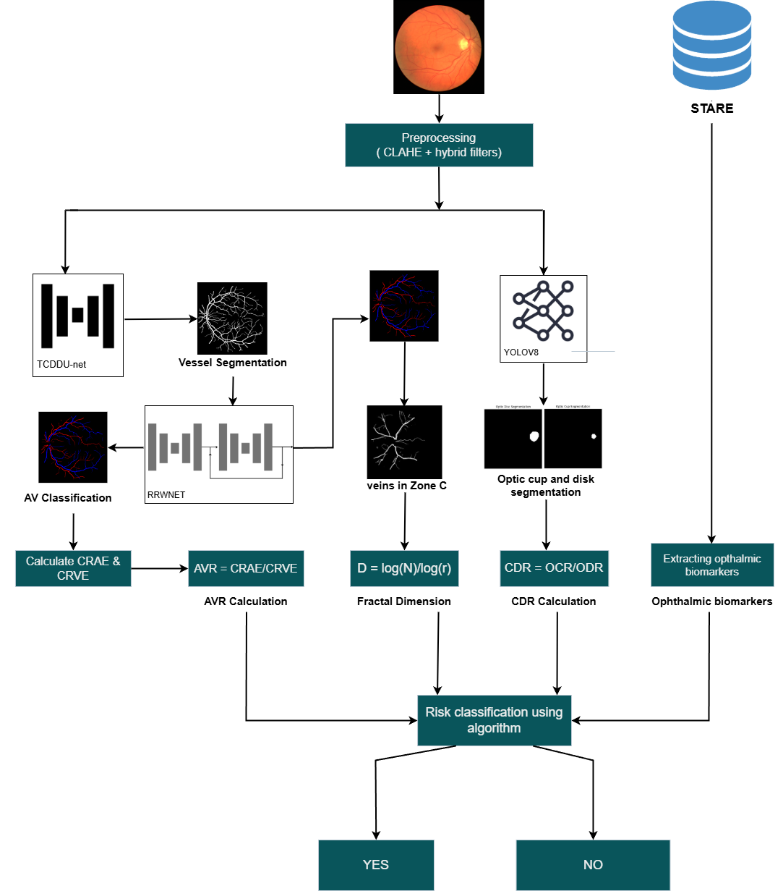

# Dual-Parameter Retinal Biomarker Analysis: Integrating Structural and Vascular Changes for Cardiovascular Disease Screening

## 📌 Overview
This web application analyzes retinal fundus images to predict cardiovascular disease (CVD) risk by integrating **vascular biomarkers** (AV ratio, fractal dimension), **structural biomarkers** (cup-to-disc ratio), and **13 ophthalmic biomarkers**. The system employs state-of-the-art deep learning models to automate biomarker extraction and applies a rule-based system for risk classification.

Our approach leverages the retina as a non-invasive "window" to assess systemic vascular health, providing early detection capabilities for CVD risk factors that may not be apparent through traditional screening methods.

---

  
*Integrated AI pipeline for retinal biomarker extraction and CVD risk classification*

---

  
*A non-invasive AI-powered tool for cardiovascular risk stratification using retinal biomarkers.*

---

## ✨ Key Features
### 1. **Multi-Biomarker Integration**
   - **Vascular Analysis**:
     - Automated vessel segmentation using TCDDU-Net (Transformer and Convolutional Dual-Path Decoding U-Net)
     - Artery/Vein classification with RRWNet (Recursive Refinement with Weight Network)
     - AV ratio calculation (<0.67 or >0.75 = high risk)
     - Fractal dimension (FD) estimation using box-counting method (<1.3 = high risk)
   - **Structural Analysis**:
     - Optic disc/cup segmentation using YOLOv8 with Focal-EIoU loss
     - Cup-to-disc ratio (CDR) computation (>0.6 = high risk)
   - **Ophthalmic Biomarkers**:
     - Classification of 13 retinal pathologies linked to CVD risk (see [Biomarker Definitions](#-ophthalmic-biomarker-definitions))

### 2. Input Flexibility
   - **Retinal Image Upload**: 
     - Supports JPEG/PNG formats (minimum 1024x1024 resolution recommended)
     - Drag-and-drop functionality
     - Image quality assessment with automated feedback
   - **Ophthalmic Biomarker Input**:
     - Manual selection via interactive checkboxes.

### 3. Interactive Outputs
   - **Visualizations**:
      - Side-by-side comparison of original and processed images
     - Overlay of segmented vessels with arteries (red) and veins (blue) differentiation
     - Optic disc/cup boundaries with CDR value annotation
     - Fractal dimension visualization with complexity indicators
   - **Risk Report**:
     - High/Low CVD risk classification
     - Detailed biomarker scores and clinical interpretations


## 🔍 Ophthalmic Biomarker Definitions
The following biomarkers are used for CVD risk stratification:

| Abbreviation | Full Name                          | Clinical Significance for CVD Risk                                                                 |
|--------------|------------------------------------|---------------------------------------------------------------------------------------------------|
| **N**        | Normal                             | No detected abnormalities.                                                                       |
| **CD**       | Coat's Disease                     | Rare vascular disorder; may indicate systemic inflammation.                                      |
| **MA**       | Macroaneurysm                      | Associated with hypertension and diabetic retinopathy.                                           |
| **D**        | Drusen                             | Lipid deposits linked to age-related macular degeneration; weak CVD association.                 |
| **BDR**      | Background Diabetic Retinopathy    | Early-stage diabetes complication; strong CVD correlation.                                       |
| **PDR**      | Proliferative Diabetic Retinopathy | Advanced diabetes complication; high CVD risk.                                                   |
| **CNV**      | Choroidal Neovascularization       | Abnormal blood vessel growth; linked to inflammation and atherosclerosis.                       |
| **AR**       | Arteriosclerotic Retinopathy       | Hard exudates and arterial narrowing; direct indicator of systemic atherosclerosis.              |
| **HTR**      | Hypertensive Retinopathy           | Flame-shaped hemorrhages; strong association with uncontrolled hypertension.                     |
| **CRVO**     | Central Retinal Vein Occlusion     | Venous congestion; correlated with hypercoagulability and cardiovascular events.                 |
| **BRVO**     | Branch Retinal Vein Occlusion      | Localized venous blockage; moderate CVD risk.                                                    |
| **HCRVO**    | Hemi-Central Retinal Vein Occlusion| Partial venous occlusion; similar risk profile to BRVO.                                          |
| **RAO**      | Retinal Artery Occlusion           | Sudden vision loss; emergency indicator for carotid artery disease or cardiac embolism.          |
| **BRAO**     | Branch Retinal Artery Occlusion    | Focal arterial blockage; associated with carotid stenosis.                                       |

---

## 📊 Risk Classification System
Our system uses a rule-based approach to classify CVD risk by integrating multiple biomarkers:

### High Risk Indicators:
1. **Presence of any high-risk ophthalmic biomarker**:
   - BDR, PDR, CNV, AR, HTR, CRVO, BRVO, HCRVO, RAO, BRAO, MA

2. **Abnormal vascular or structural parameters**:
   - AV Ratio: < 0.67 or > 0.75
   - Cup-to-Disc Ratio (CDR): > 0.6
   - Fractal Dimension (FD): < 1.3

### Risk Calculation Logic:
```
IF any high-risk ophthalmic biomarker is present:
    CVD_Risk = HIGH
ELSE IF (AVR is abnormal) OR (CDR > 0.6) OR (FD < 1.3):
    CVD_Risk = HIGH
ELSE:
    CVD_Risk = LOW
```

---

## 🛠️ Installation
### Prerequisites
- Python 3.8+
- NVIDIA GPU (recommended) with CUDA 11.7
- 8GB+ RAM
- 10GB free disk space

### Steps
1. **Clone Repository**:
   ```bash
   https://github.com/Aswin-programmer/Dual-Parameter-Retinal-Biomarker-Analysis-for-Cardio-Vascular-Disease-Screening.git
   ```

2. **Create and Activate Virtual Environment** (optional but recommended):
   ```bash
   python -m venv venv
   # On Windows
   venv\Scripts\activate
   # On macOS/Linux
   source venv/bin/activate
   ```

3. **Install Dependencies**:
   ```bash
   pip install -r requirements.txt
   ```

4. **Launch the Application**:
   ```bash
   python app.py
   ```

5. **Access the Web Interface**:
   Open your browser and go to: http://localhost:5000

---

## 💻 Input Format
### Single Image Upload
Upload a high-resolution retinal fundus image through the web interface.

### Ophthalmic Biomarker Selection
Check any detected or diagnosed conditions from the 13 available biomarkers.


## 🖥️ Usage Examples

### Basic Analysis
1. Upload a retinal fundus image
2. Select any diagnosed ophthalmic conditions
3. Click "Analyze" to process the image
4. View the visualization outputs and risk assessment


## 📋 Results Interpretation

### Visual Outputs
- **Vessel Segmentation View**: Highlights the extracted vascular network
- **AV Classification View**: Color-coded arteries (red) and veins (blue)
- **Cup-Disc Segmentation View**: Boundaries of optic disc (yellow) and cup (green)
- **Fractal Analysis View**: visualization showing vascular complexity measurement

### Risk Assessment
The final report includes:
- **Overall CVD Risk Classification**: High or Low
- **Individual Biomarker Analysis**: Values and abnormality indicators
- **Clinical Interpretation**: Automated insights based on detected patterns
- **Confidence Score**: Reliability metric for the assessment

---

## 🧠 Technical Details

### Deep Learning Models
- **TCDDU-Net**: Vessel segmentation with transformer-CNN hybrid architecture
- **RRWNet**: Recursive refinement network for artery-vein classification
- **YOLOv8 + Focal-EIoU**: Advanced object detection for optic disc/cup segmentation

### Processing Pipeline
1. **Preprocessing**: Image quality enhancement using CLAHE and hybrid filtering
2. **Vessel Segmentation**: TCDDU-Net extraction of vascular network
3. **AV Classification**: RRWNet separation of arteries and veins
4. **Optic Structure Analysis**: YOLOv8 detection of disc and cup boundaries
5. **Fractal Analysis**: Box-counting method for vascular complexity assessment
6. **Risk Integration**: Rule-based system combining all biomarkers

---

## 📚 Research Background
This application implements the methodology described in our research paper:

*"Dual-Parameter Retinal Biomarker Analysis: Integrating Structural and Vascular Changes for Cardio Vascular Disease Screening"* by Gautham Suresh, Sharvesh S, Jagadeeswar V, Aswin M, and Dr. Swapna T R.

The retina provides a unique window into systemic vascular health, with changes in retinal vasculature often preceding clinical manifestations of cardiovascular disease. Our approach combines multiple biomarkers to improve the sensitivity and specificity of CVD risk prediction through non-invasive imaging.

---


## 👥 Contributors
- Gautham Suresh
- Sharvesh S
- Jagadeeswar V
- Aswin M
- Dr. Swapna T R

---

## 📄 License
This project is licensed under the MIT License - see the LICENSE file for details.

---

*This tool is for research and screening purposes only and should not replace professional medical advice or diagnosis.*
